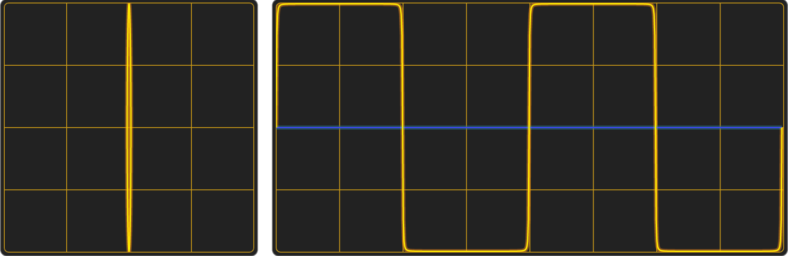

# snyth

_tl;dr:_ the web app is [here](https://transcriptaze.github.io/snyth.html) and there is a basic user guide [here](documentation/guide.md). Be warned, it's just barely alpha software so expect some rough edges and also **please** see the [notes](NOTES.md)
for things like browser compatiblity (basically Chrome is ok, mostly) and MIDI files.

_snyth_ is an experimental additive synthesizer that uses the _Jacobi ellipse_ as the generator function. By
adjusting the eccentricity, rotation and horizontal shift of an ellipse a single oscillator can morph smoothly
and intuitively between sine, square, triangular and sawtooth waveforms. 

|                            **sine**                          |                     **square**                             |
:-------------------------------------------------------------:|:-----------------------------------------------------------:
|        |    |
|                            **triangular**                    |                       **sawtooth**                         |
|  |  |

The canonical _snyth_ experience: 
   1. _Power up_.
   2. Hit _Reset_ to reset everything to the most basic synthesizer.
   3. Start the _Take Five_ MIDI (3rd slot from the top on the retro cassette tape).
   4. And then just play with the controls to hear it come alive as you add harmonics and distortions.

Please bear in mind that this is still very early stage and also experimental and there are more than few rough
edges. Have fun!

## Background

At it's most basic, additive audio synthesis typically starts with four basic functions:
- sine 
- square
- triangular
- sawtooth

which are filtered, modulated, distorted and otherwise shaped to create the desired ouput sound. As commonly presented,
the square, triangular and sawtooth waveforms are the theoretical result and practical implementation of summing an
infinity of sine waves to generate a harmonically rich sound.

Mathematically though, a sine can be seen as a special case of a Jacobi elliptic _sn_ function in the same way that
a circle is a special case of an ellipse. From there, it's a small step from using a circle as a generator function
for a sine wave to using the Jacobi _sn_ function and corresponding Jacobi ellipse as a harmonically rich generator
function for an audio oscillator.

The Wikipedia page on the [Jacobi ellipse [1]](#1) makes this a bit clearer, although the explanation in 
[Elliptic functions as trigonometry [2]](#2) is substantially easier to follow.

Some points of interest:
 - A sine is of course a special case of an ellipse with eccentricity 0.
 - Ellipses with eccentricities approaching -1 and +1 approximate the square and triangular functions (shown above).
 - An ellipse with an eccentricity between 0 and -1 _squashes_ the wave into a shape with round shoulders that is
   very characteristic of valve distortion. 
 - An ellipse with an eccentricity between 0 and 1 _squishes_ the sine into a shape reminiscent of the distortion
   characteristic of early transistor amplifiers. 
 - A sawtooth is an asymmetric waveform which can't be directly approximated using an ellipse that is symmetric
   about the origin, but shifting the ellipse along the horizontal axis does a reasonable job (although it's not
   at all clear what the maths is doing - probably just huddled in a corner in horror). Stacking two _sn_ waves
   and playing carefully with the settings produces a quite credible waveform. 
- The square wave is continuous and continuously differentiable (which a real square wave is not) right up to the
  limit at which the eccentricity is exactly ±1.

### Summary

All of which means that the four separate oscillator functions can be replaced by a single not-very-complicated
function that can be smoothly varied across it's range e.g. using a VCA. 

The _Greensleeves_ demo on YouTube is an example of using this to render a version of _Greensleeves_ in which
every single note is ever so slightly different and also varies during the note as well. While this isn't
all that difficult to do using other synthesizers, this particuarly rendering is _snyths_ all the way down 
and pleasingly elegant.

## Generalising to other shapes

In 2023, there's more to life than ellipses and with the merest smidgeon of hand-waving it's possible
to extend the concept to other shapes. Audio-wise, the other shapes are more visually entertaining than 
acoustically radical but can be useful when creating a curve for use as an LFO. Or of course for creating
that idiosyncratic sound that is yours alone.

### Polygons

Shapes that identify as convex polygons are relatively straightforward to implement and the web app includes:
- square
- diamond
- pentagon
- triangle
- cowbell

Concave polygons have some weird edge cases though and need a bit more thought but should hopefully make into a 
release quite soon.

## Waivers and Demurrers

This seems relatively novel which is surprising considering the basically simplicity. It's quite possibly
just lurking somewhere under a different name, but the only related work I've stumbled across so far is:

- Lance Putnam's [thesis [3]](#3) and [publications [4]](#4) which approach it from a different direction
  (pattern generation).

- Agostino Di Scipio's two papers on audio synthesis using iterated non-linear functions (with an implementation
  in Supercollider):
  - [Synthesis Of Environmental Sound Textures by Iterated Nonlinear Functions [7]](#7)
  - [Iterated Nonlinear Functions as a Sound-Generating Engine [7]](#7)
  - [SuperCollider:GFIS [8]](#8)

## Contributions

This is an umbrella repository and all the actual code lives in submodules:

- [snyth-js](https://github.com/transcriptaze/snyth-js) for the HTML, CSS and Javascript source that go to 
  make up the web app. The actual web-app is a web-packed version of this repo.
- [snyth-pd](https://github.com/transcriptaze/snyth-pd) is a PureData implementation in PureData. At the moment
  there isn't much beyond a basic working demo.
- [snyth-supercollider](https://github.com/transcriptaze/snyth-supercollider) is a Supercollider UGen for the 
  basic _sn_ function and a couple of demo scripts.

### MIDI

While it would be great to have a library of really good MIDI files it's not entirely clear what the legal situation
would be about hosting them in a github repository and rather than deal with DMCA takedown notices:

1. If you want to submit a MIDI file, please create a pull request against the MIDI branch of this repository.
2. The pull request should:
   - Update the MIDI files list with a link to where you are hosting the MIDI file
   - Include the MIDI file
   - Include a _snyth.json_ file
3. After merging the pull request the MIDI files themselves will be stashed somewhere safe (but in good company) 
   until the legal situation is clearer.

## Licensing

Everything in this repository (and all it's submodules) is licensed under GPL-3.0. 

## Notes

## References and Related

<a id="1">1.</a> [Jacobi_elliptic_functions](https://en.wikipedia.org/wiki/Jacobi_elliptic_functions#Definition_as_trigonometry:_the_Jacobi_ellipse)

<a id="2">2.</a> [Elliptic functions as trigonometry](https://iopscience.iop.org/book/mono/978-1-6817-4230-4/chapter/bk978-1-6817-4230-4ch1)

<a id="3">3.</a> [Lance Putnam: The Harmonic Pattern Function: A Mathematical Model Integrating Synthesis of Sound and Graphical Patterns](https://w2.mat.ucsb.edu/l.putnam/papers/ljp_diss_final.pdf)

<a id="4">4.</a> [Lance Putnam: List of Publications](https://w2.mat.ucsb.edu/l.putnam)

<a id="5">5.</a> [The history of the universe is an elliptic curve](https://arxiv.org/abs/1411.2192)

<a id="6">6.</a> [The Synthesis of Environmental Sound Textures by Iterated Nonlinear Functions and its Ecological Relevance to Perceptual Modeling](https://www.academia.edu/84487853/The_Synthesis_of_Environmental_Sound_Textures_by_Iterated_Nonlinear_Functions_and_its_Ecological_Relevance_to_Perceptual_Modeling)

<a id="7">7.</a> [Iterated Nonlinear Functions as a Sound Generating](https://direct.mit.edu/leon/article-abstract/34/3/249/44078/Iterated-Nonlinear-Functions-as-a-Sound-Generating)

<a id="8">8.</a> [SuperCollider:GFIS](https://pustota.basislager.org/_/sc-help/Help/Classes/GFIS.html)

<a id="9">9.</a> [Mathematicians Complete Quest to Build Spherical Cubes](https://www.quantamagazine.org/mathematicians-complete-quest-to-build-spherical-cubes-20230210)

<a id="10">10.</a> [Chaos Theory for Synthesizers](http://ijfritz.byethost4.com/Chaos/ch_over.htm)

<a id="11">11.</a> [Introduction to the Transcendent Waveform Analog Oscillator ](https://www.youtube.com/watch?v=xdjGRF7Wtwg)

<a id="12">12.</a> [Spatial Audio, Francis Rumsey](https://www.routledge.com/Spatial-Audio/Rumsey/p/book/9780240516233)

## Attributions

1. FFT by [nayuki.io](https://www.nayuki.io/page/free-small-fft-in-multiple-languages).
2. The _Greensleeves Too_ MIDI is based on _Charles Duncan's_ fingerstyle guitar arrangement.
3. Loop, settings and info icons by [onlinewebfonts.com](http://www.onlinewebfonts.com/icon).
4. Save icon (https://www.iconarchive.com/show/flatwoken-icons-by-alecive/Apps-File-Save-icon.html)
5. Sound wave icon (https://clipground.com/images/sound-wave-icon-png.png)