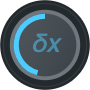

# User Guide

The user interface can be divided up into six sections:

- the [_Controls_](#controls) area at the top
- the  page which displays the _sn_ oscillator parameters
- the  page which displays the note envelope editor
- the  page which displays the low frequency oscillator parameters and patch bay.
- the  page which displays all the settings with options to save and restore to/from a file.
- the  page which displays miscellaneous information.

## Controls

### Power On

 The _Power_ button enables or disables web
audio. 

It's technically anachronistic but not superfluous because Chrome and Firefox (and probably the other browsers too)
mandate a user action to enable web audio and it also turns out to be occasionally convenient to have a way to stop everything.

### Volume

 The _Volume_ control sets the output volume. The secondary
display around the outside displays the dynamic volume which will vary according to the output of the LFO assigned to the
volume plug.

### Play/Pause

 The _Play_ button toggles between playing the selected MIDI file and pausing playback. 

_alt-play_ toggles _loop_ mode - when the _loop_ icon is highlighted, playback will restart on reaching the end of the current MIDI file.

### Mode

 The _Mode_ button toggles the internal source between a wavetable
based oscillator and a DDS oscillator. The difference is that a wavetable oscillator does a lookup against a table of values to 
generate the audio while the DDS oscillator calculates the waveform on the fly (this isn't what is normally considered DDS synthesis
but for want of a better term it will have to do). 

In general the wavetable implementation:
- is more efficient and can handle more simultaneous notes
- generates a less accurate waveform (but TBH you'd be hard pressed to hear it)
- only recalculates the wavetable when the mouse button is released
- only recalculates the wavetable for LFO inputs at the animation rate 

The DDS implementation is more CPU intensive and cannot synthesize as many simultaneous notes as the wavetable,
but:
- the resulting waveform is more accurate
- recalculates the waveform at the k-rate so the audio follows the controls as they are adjusted
- recalculates the waveform for LFO inputs at the k-rate

### Envelope

 The _Envelope_ button cycles through the 
_favourited_ envelopes, setting the active synthesizer note envelope to the currently selected envelope.

### Load

 The _Load_ button downloads the current oscillator and envelope
settings to the _wavetable_ synthesizer. 

_alt-load_ toggles the _load_ mode between _auto_ and _manual_ mode. In _auto_ mode the updated oscillator and envelope
settings are downloaded when the mouse button is released after changing a setting. In _manual_ mode the settings are
downloaded by clicking on the _load_ button.

### Gain

 The _Gain_ control adjusts the internal level to avoid clipping 
when the level gets too high (or cause clipping if that's what you want). The secondary display around the outside displays the
dynamic gain which will vary according to the output of the LFO assigned to the gain plug.

### Record

 The _Record_ control records the song playing until it ends 
(or is stopped). The recorded audio can then be downloaded as an OGG file by clicking on the download arrow.

### Picker

 The _Picker_ control loads a MIDI file for playback. 
Clicking on the retro cassette tape will open a file picker to load a MIDI file from disk. _alt-click_ will load and
queue the file to be played once the current song is finished.

The _slots_ are for MIDI files located at URLs. Clicking on an empty (i.e. not highlighted) _slot_ will open a dialog
for a URL and the MIDI file at that URL will be downloaded to browser local storage and assigned to that slot for future
use. _ctrl-click_ on the _slot_ clears the MIDI file for that slot and _alt-click_ adds it to the playlist queue.

### Keyboard

Just a keyboard (white keys only). Click to play a _note_ and _alt-click_ to hold a note (_click_ or _alt-click_ releases it). 
Mostly useful for experimenting with settings or creating samples but you might be able to play _Three Blind Mice_ if you are
really adept.

## OSC

The **OSC** panel sets the parameters for the three _sn_ oscillators.

### _shape_ 

 The _shape_ button toggles between the available
generator shapes (currently _ellipse_ and _square_). Be warned - if you're wearing headphones, the transition can occasionally be
abrupt.

### _multiplier_ (m)

 The _multiplier_ button sets the multiplier for the basic oscillator
frequency, with a range between 1 and 10.Be warned - if you're wearing headphones, the transition can occasionally be
abrupt. It's on the TODO list to fix .. sigh ..

### _eccentricity_ (ε)

 The _ε_ control adjusts the eccentricity (ratio of 
height to width) of the shape being used as a generator. The transform is highly non-linear with the most effect being heard
at the extremes where the adjustment range is also the smallest - to accomodate this, the eccentricity can be set approximately
to the desired value usin the _ε_ control and then tweaked using the more sensitive _𝗌_ control.

_ctrl-click_ resets the control to 0.

### _sensitivity_ (𝗌)

 The _𝗌_ control is the fine adjustment control for
the eccentricity of the shape being used as a generator. It adjusts the value set by the _ε_ control but has a smaller range 
for the same range of motion.

_ctrl-click_ resets the control to the midpoint.

### _rotation_ (𝜃)

 The _𝜃_ control adjust the angle of rotation
of the shape. Audionically (?) the effect is mostly fairly subtle and more apparent as a phase effect (i.e. your ears will
hear it while it is changing and hardly at all when it is static) and more audible wih an angular shape like a square. It is
most useful for waveshaping an LFO curve but an othewise idle LFO can sweep the rotation back and forth to give it something to
do.

_ctrl-click_ resets the control to 0.

### _amplitude_ (a)

 The _a_ control sets the amplitude of the _sn_ oscillator.

_ctrl-click_ resets the control to the default value.

### _shift-x_ (δx)

 The _δx_ control sets the horizontal shift of the generating shape
to create non-symmetric waveforms e.g. a sawtooth. 

_ctrl-click_ resets the control to 0.

### _shift-y_ (δy)

 The _δy_ control sets the vertical shift of the generating shape. The
resulting waveform has a distortion characteristic that can be useful in conjunction with an LFO.

_ctrl-click_ resets the control to 0.

### _phase_ (Φ)

 The _Φ_ control sets initial phase the waveform component. The effect
is barely audible (though it's useful for adjusting the waveform to look nice - y'know for photo ops) but comes into it's own
when shaping an LFO curve.

_ctrl-click_ resets the control to 0.

### _psi_ (𝜓)

 _psi_ sets the 
left-to-right channel phase difference (±90°) to pan the audio without changing the volume (unlike balance which 
sets the left-to-right volume). It does not affect visual appearance of the waveform but is audible on headphones, e.g:
- _Reset_ the controls so that the synthesizer is playing a pure sine wave on the _red_ component only.
- Adjust the 𝜓 control hard left and the audio will appear to playing on the left only - but by listening to the
  left and right earphones seperately it's apparent that audio is playing on both left and right at similar volumes.

The _psi_ parameter is (mostly) intended for experimenting with binaural effects and allows components of a note to be placed
and moved spatially without affecting the volume e.g. using an LFO.

_ctrl-click_ resets the control to 0.

### _balance_ (b)

 The _b_ control sets left/right volume balance.

_ctrl-click_ resets the control to 0.

## ENV

The **ENV** panel sets the parameters for the audio envelope that can be applied to the notes played by the synthesizer.

There synthesizer provides twelve envelopes that can be selected and edited individually:
- four basic AR envelopes
- eight ADSR envelopes

Clicking on any envelope button in the _envelope grid_ selects that envelope as the current envelope for the synthesizer
and displays the envelope parameters in the envelope editor. Changing the envelope parameters for the envelope in the editor
will update the active envelope in the synthesizer and envelope settings are saved across sessions in the browser local storage. 

### _envelope_

 The _envelope_ button selects the
envelope attached to that button as the active envelope in the synthesizer and displays the envelope parameters in the
envelope editor. A highlighted _star_ icon on a button indicates that the envelope is _favourited_ i.e. included in the list of envelopes that can be cycled through by clicking on the synthesizer _ENVELOPE_ button at the top of the page. 

- _alt-click_ on an _envelope_ button will toggle the _favourited_ star icon. 
- _ctrl-click_ on an _envelope_ button will reset the envelope to the predefined default values for that envelope.

An envelope with all parameters set to the _default_ values for that envelope type is displayed _dimmed_. It can still be used
as the active envelope in the synthesizer but it's a place to start rather than anything particularly interesting.

### attack

### decay

### sustain

### release

### Editor

## LFO

The **LFO** panel sets the parameters for the four _LFO_ oscillators. The LFO oscillators comprise three independent (red, green
and blue) oscillators and one oscillator (orange) that is the sum of the other three, allowing for a complex waveform. The operation
of the LFOs is a litle counter-intuitive:
- the waveshape and amplitude of the main LFO (orange) is as displayed on the waveform
- the red, green and blue LFOs however have a fixed amplitude so even when the _amplitude_ (_a_) control is set to zero, they can still
be used as parameter modifiers for the _sn_ oscillators. A bit of experimentation should make it clear.

### _shape_ 

 The _shape_ button toggles between the available
generator shapes (currently _ellipse_ and _square_). 

### _multiplier_ (m)

 The _multiplier_ button sets the multiplier for the basic oscillator
frequency, with a range between 1 and 10.

### _eccentricity_ (ε)

 The _ε_ control adjusts the eccentricity (ratio of height to width) of
the shape being used as a generator. The transform is highly non-linear with the most effect at the extremes where the adjustment
range is also the smallest - to accomodate this, the eccentricity can be set approximately to the desired value usin the _ε_ control
and then tweaked using the more sensitive _𝗌_ control.

_ctrl-click_ resets the control to 0.

### _sensitivity_ (𝗌)

 The _𝗌_ control is the fine adjustment control for the eccentricity of
the shape being used as a generator. It adjusts the value set by the _ε_ control but has a smaller range  for the same range of motion.

_ctrl-click_ resets the control to the midpoint.

### _rotation_ (𝜃)

 The _𝜃_ control sets the angle of rotation of the generating shape
which has the effect changing the waveform as well as moving it left and right (unlike the phase control which just moves the 
waveform left and right).

_ctrl-click_ resets the control to 0.

### _amplitude_ (a)

 The _a_ control sets the contribution of the _LFO_ component to the
in the summed LFO waveform. The corresponding LFO amplitude is not affected by the amplitude control, allowing the the LFO component
to be used as a parameter modifier even when the ampitude is set to zero.

_ctrl-click_ resets the control to the default value.

### _shift-x_ (δx)

 The _δx_ control sets the horizontal shift of the generating shape
to create non-symmetric waveforms e.g. a sawtooth. 

_ctrl-click_ resets the control to 0.

### _shift-y_ (δy)

 The _δy_ control sets the vertical shift of the generating shape to 
get some truly weird LFO curves.

_ctrl-click_ resets the control to 0.

### _phase_ (Φ)

 The _Φ_ control sets the phase of a waveform component which is
really useful moving the peak back and forth to get an LFO waveform of a desired shape.

_ctrl-click_ resets the control to 0.

### _frequency_ (f1, f2, f3 and f4)

### _range_ 

### Patchbay

## Settings

The settings page displays the numeric (or text) values for all the current parameters, with options to:
- Save the current values as a JSON file
- Restore the settings from a saved file
- Clear everything to the default values (the _Reset_ button only resets the OSC parameters, not the envelope or LFOs).

### Save

### Restore

### Clear

## Info

Basic application information, attributions for CCL licensed content and the cookies policy.

